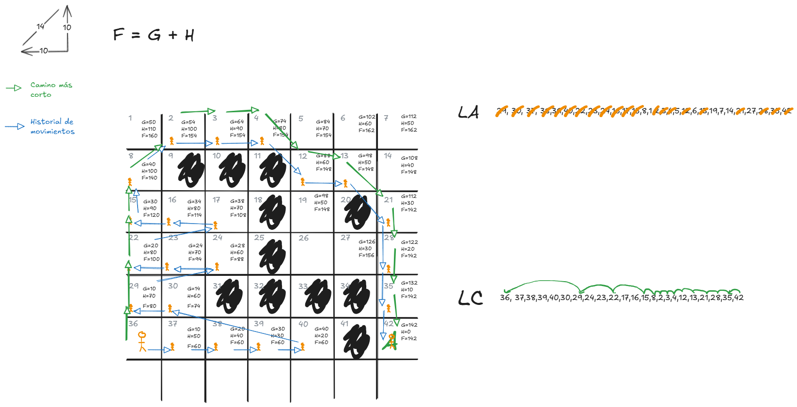
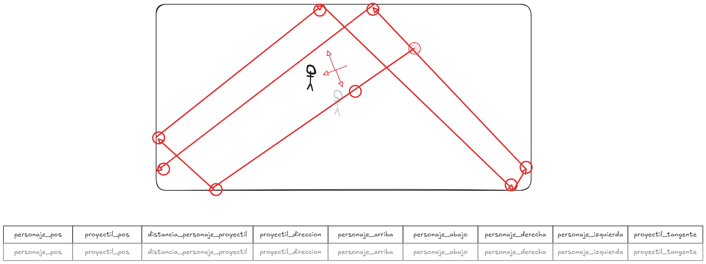

## Obed Gonzalez Hernandez - 21121524

Lista de actividades para la materia de **Inteligencia Artificial**.

---
## [Actividad 1](actividades/Actividad%201.md)

## [Actividad 2](./actividades/Actividad%202.md)
Plantear un dataset para el juego mostrado en la imagen:

## [Actividad 3](./actividades/Actividad%203.md)
Calcular la matriz de convolución de suavizado:

