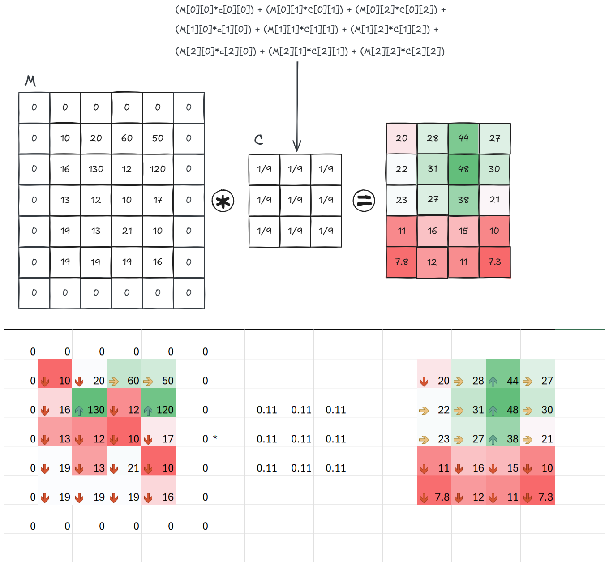

---
tags:
  - actividad
  - inteligencia-artificial
  - unidad-1
date: 2025-09-25
---
Ejercicio de convolución que suaviza una imagen.

El resultado de la convolución se muestra en la siguiente imagen:

Y las operaciones que se realizaron con la matriz estan en el archivo de Excel [convolucion.xlsx](./convolusion.xlsx)
